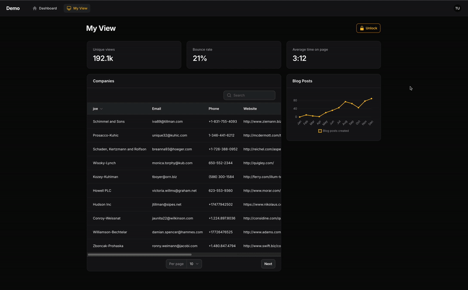

# Not published - Under active development.

# Filament Layout Manager

[](https://packagist.org/packages/asosick/filament-layout-manager)
[](https://github.com/asosick/filament-layout-manager/actions?query=workflow%3Arun-tests+branch%3Amain)
[](https://github.com/asosick/filament-layout-manager/actions?query=workflow%3A"Fix+PHP+code+styling"+branch%3Amain)
[](https://packagist.org/packages/asosick/filament-layout-manager)


### Allows users to customize and save their own dashboards composed of livewire components.

## Installation

You can install the package via composer:

```bash
#COMING SOON
#composer require asosick/filament-layout-manager
```

You can publish the config file with:

```bash
php artisan vendor:publish --tag="filament-layout-manager-config"
```

Optionally, you can publish the views using

```bash
php artisan vendor:publish --tag="filament-layout-manager-views"
```

## Usage
Reorderable Dashboards require a new custom page. You can create one as so

```bash
php artisan make:filament-page TestPage
#Replace TestPage with your new page's name
```

You custom page needs to extend from `use Asosick\FilamentLayoutManager\Pages\LayoutManagerPage;`

```php
use Asosick\FilamentLayoutManager\Pages\LayoutManagerPage;
class TestPage extends LayoutManagerPage
{}
```

You can now define the livewire components you'd like users to be able to add to this new page (this includes your widgets, custom components, or even your ListRecord views though that is not recommended)
```php
class TestPage extends LayoutManagerPage
{
    protected static ?string $navigationIcon = 'heroicon-o-document-text';

    protected ?string $maxContentWidth = MaxWidth::class;

    protected function getComponents(): array
    {
        // Replace with your chosen components
        return [
            CompaniesWidget::class,
            BlogPostsChart::class,
            StatsOverview::class,
            ArticlePostsChart::class,
        ];
    }
}
```
You can now visit your page, unlock your layout, and begin reorganizing.

### Passing Widget Data
Similar to a traditional filament page, you are able to pass data directly to your widgets. (Support for passing data to custom components coming soon...)

Keep in mind, data passed to this widget will be applied to all instances of this widget***

```php
class TestPage extends LayoutManagerPage
{
    protected function getComponents(): array
    {
        return [
            CompaniesWidget::make([
                'company' => 'Apple'
            ]),
        ];
    }
}
```

## Multiple Layouts
Users are able to define multiple layouts they can switch between.

Each layout is mapped to a keybinding based on its number:
* `command+1 | ctrl+1` => layout 1
* `command+2 | ctrl+2` => layout 2 
* so forth...

The default number of views can be changed by the `$layoutCount` variable in your page class, or via the configuration file. 

## Customization
Your reorderable livewire components are wrapped inside a custom livewire component defined by this library which enables user manipulation.

Do not confuse this with the Page class or its blade view as defined above, that is not a livewire component, and is only responsible for rendering the
wrapper component which encloses the livewire components you chose and enables users to manipulate them.

The wrapper class w `Asosick\FilamentLayoutManager\\Http\Livewire\LayoutManager.php`

In order to customize say the colour of one of the header buttons, first:

#### 1)
```bash
php artisan vendor:publish --tag="filament-layout-manager-config"
```
#### 2)
Create a new class in your application called (for example) `App\Livewire\CustomReorderComponent.php` and extend that class off of `Asosick\FilamentLayoutManager\\Http\Livewire\ReorderComponent.php`

```php
<?php

namespace App\Livewire;

use Asosick\FilamentLayoutManager\Http\Livewire\LayoutManager;
use Filament\Actions\Action;

class CustomReorderComponent extends LayoutManager
{

    /* Example of changing the colour of the add button to red */
    public function addAction(): Action
    {
        return parent::addAction()->color('danger');
    }
}
```
#### 3)
Update your configuration to point to your new custom class.
```php
// config for Asosick/FilamentLayoutManager
return [
    'LayoutManager' => \App\Livewire\CustomReorderComponent::class,
    // Other settings 
    // ...
];
```

I recommend reading the code in ReorderComponent when digging into customization. You'll want to ensure you're still calling the require methods on actions you edit.


### Saving Layouts to a Database
Layouts by default are saved to a user's session ergo they are not persisted to hard storage.

In order to save your user's layout to a database (or file, etc.), you'll need to
1. Override the ReorderComponent as shown above
2. Implement a new `save()` function to persist the layout
3. Implement a new `load()` function to load the layout

**Where a user's layout is saved in your database and how that is managed is your concern.**

There needs to be somewhere to store this information. Perhaps a json column on your user's table called `settings` for example. You'll need to create a column if it doesn't exist in your DB.

#### Example
Assuming a settings json column on your user's model where the components array (declared inside `ReorderComponent` and contains the layout information)
is stored in `settings['components']`.

```php
namespace App\Livewire;

use Asosick\FilamentLayoutManager\Http\Livewire\LayoutManager;
use Illuminate\Support\Arr;

class CustomReorderComponent extends LayoutManager
{
    public function save(): void
    {
        $user = auth()->user();
        $user->settings = [
            'components' => $this->components
        ];
        $user->save();
    }

    public function load(): void
    {
        $user = auth()->user();
        $this->components = Arr::get(
            json_decode($user->settings, true),
            'components',
            []
        );
    }
}
```

[//]: # (This is the contents of the published config file:)

[//]: # ()
[//]: # (```php)

[//]: # (return [)

[//]: # (];)

[//]: # (```)
[//]: # ()
[//]: # (## Usage)

[//]: # ()
[//]: # (```php)

[//]: # ($reorderWidgets = new Asosick\ReorderWidgets&#40;&#41;;)

[//]: # (echo $reorderWidgets->echoPhrase&#40;'Hello, Asosick!'&#41;;)

[//]: # (```)

[//]: # ()
[//]: # (## Testing)

[//]: # ()
[//]: # (```bash)

[//]: # (composer test)

[//]: # (```)

## Changelog

Please see [CHANGELOG](CHANGELOG.md) for more information on what has changed recently.

## Contributing

Please see [CONTRIBUTING](.github/CONTRIBUTING.md) for details.

## Security Vulnerabilities

Please review [our security policy](../../security/policy) on how to report security vulnerabilities.

## Credits

- [August](https://github.com/asosick)
- [All Contributors](../../contributors)

## License

The MIT License (MIT). Please see [License File](LICENSE.md) for more information.
